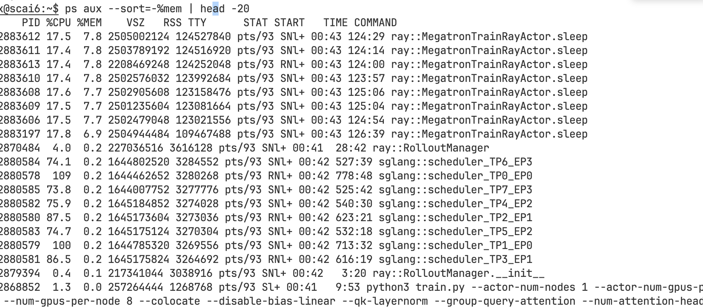

# CPU

在使用slime框架训练30B MoE的时候明显感觉到cpu主机内存（RAM）消耗在增大，试着分析一下内存占用的几大源头。

- 第一大头是 offload / colocate 模式会主动把训练侧状态挪到 CPU。slime 参数里写得很明确：--colocate 打开时会强制开启 offload；--offload-train / --offload-rollout 则分别控制训练 actor 和 rollout generator 在不工作时下沉到 CPU。actor 的 sleep() 里会调用 torch_memory_saver.pause()，wake_up() 里再 resume()；而且 sleep() 前会 clear_memory(clear_host_memory=True)。这套逻辑本身就意味着为了让训练和推理共卡，框架会有意识地把一部分对象驻留到 host 侧。
- 第二大头是来自于是 TensorBackuper。在 actor 初始化时，slime 会创建 weights_backuper （slime/backends/megatron_utils/actor.py）。其正常实现 _TensorBackuperNormal.backup() 会对每个参数/buffer 分配一个 torch.empty_like(..., device='cpu', pin_memory=True)，然后把 GPU 参数拷到这块 CPU pinned memory 里。也就是说，默认情况下它会在主机侧做一份几乎等体积的参数镜像。这个设计是为了在 actor / ref / teacher / old_actor / rollout_actor 之间快速切换，以及给 rollout 做权重更新。代码里对应的 CLI 提示也写了：--disable-weights-backuper 可以“save host memory”。
- 在此基础上，多 tag 备份会把这份 CPU 副本乘起来。初始化时，actor 至少会 backup("actor")；如果开了 KL/reference，就还会加载 ref；如果开了基于 Megatron 的 OPD，会再有 teacher；如果保留旧策略，还会有 old_actor；update_weights_interval == 1 时还会再备一个 rollout_actor。可以参考`self.weights_backuper.backup_tags`这个操作。模型越大，host RAM 膨胀越明显。
- 第三个来大头是 PyTorch 的 host pinned-memory cache memory_utils.clear_memory(clear_host_memory=True) 里直接调用了 torch._C._host_emptyCache()。

## 先估算一遍

具体到我们现在的配置下，给定8 卡、TP=4、PP=1、CP=1、EP=4、ETP=1。同时开了 --colocate，所以训练和 rollout 共卡并强制打开 train/rollout 的 offload。因为没有开 --disable-weights-backuper，所以默认会启用 CPU 侧的权重备份。因为还开了 --use-kl-loss 并提供了 --ref-load，因此 actor 之外还会有一份 reference 权重。Qwen3-30B-A3B 的官方参数规模总参数约 30.5B，其中3.3B激活，共有 128 个 experts，8 个被激活。粗略统计，dense的attention 部分大约是1.487B ，全部 expert 参数合计大约 29.013B，单个 expert 约 0.2267B 。

在此配置下，单个训练 rank 实际持有的参数量可以近似写成：local_params_per_rank ≈ dense/TP + experts_total/EP，即local_params_per_rank = 1.487/4 + 29.013/4 ≈ 7.625B

- 先看weight_backuper,每个 backup tag 的 CPU RAM ≈ 本 rank 参数量 × 参数字节数。按照BF16计算，param_per_rank_per_tag = 7.625B × 2 bytes = 15.25 GB, 当前至少actor+ref两个tag
    - 每个rank差不多30GB
- 因为开了 --optimizer-cpu-offload，会把 optimizer states 放到 CPU。而 --use-precision-aware-optimizer 会把 exp_avg、exp_avg_sq 这类状态降到 BF16，并且在 BF16 训练时只额外存 FP32 master weight 的低 16-bit remainder，从而显著降低优化器内存。文档给出的核心含义可以概括成：相比传统 Adam 常见的 12 bytes/param 级别，precision-aware 的常驻 optimizer state 更接近 6 bytes/param 这个量级。 [文档在这里](https://docs.nvidia.com/megatron-core/developer-guide/latest/user-guide/features/moe.html)
    - 所以optimizer_params_per_rank ≈ 7.625B 乘上 precision-aware CPU Adam 的约 6 bytes/param = 45.6 GB
- Megatron 还会保留：
    - gradient buffer
    - param buffer
    - NCCL bucket
    - activation recompute buffer
    - 只能先粗略的按照模型权重大小估算成30G
- 得出结论每个rank大约消耗105GB

## 实际监控

- 从RSS可以看出ray::MegatronTrainRayActor.sleep的RSS = 118GB